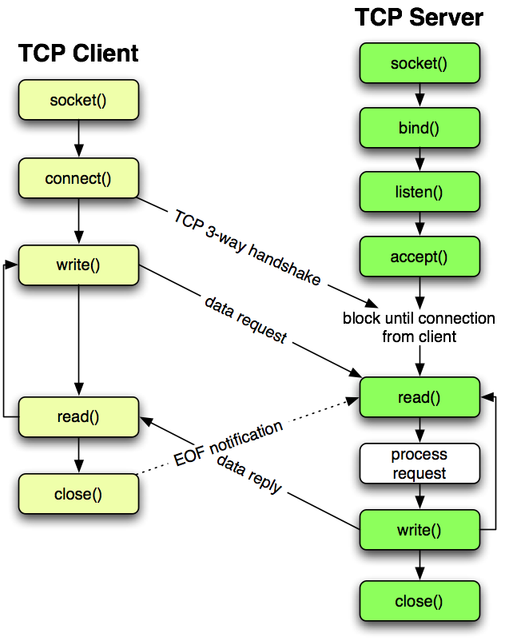

<style>
    h1 {
        border-bottom: none
    }
</style>        

### <center><font face="宋体">数据通信大作业</center>

### <center> <font face="宋体">2020 春季</center>

------

# <center><font face="微软雅黑">传输视频的目标识别</center>

------

</br>

</br>

<center>刘国涛   181860055

<center>吴泳锟   181180141

<div STYLE="page-break-after: always;"></div>
</br>

</br>

<p align="right"><font face = "Arial"><font size = 5>CHAPTER</font> <font size = 8>1</p>
</br>

<hr>

<p align="right"><font size = 5>项目概述</p>
<hr>

</br>

### <center>1.1  项目背景

​       基于socket的数据通信是互联网、云计算的技术基础。我们希望使用socket通信实现多客户端与服务端的视频传输，并由服务端返回视频内容的目标识别结果。这个过程可以是离线的，也可以是实时的。

​       这样的交互过程应用场景广泛。可用于公共场所摄像头的实时监控，及时判断危险事件的发生。还可通过云端的视频识别结果生成语音描述，为失明人士“观看“视频提供另一种可能。

</br>

### <center>1.2  预期功能

1. 视频上传（客户端、服务端）

2. 内容识别（服务端）

3. 结果展示（客户端）

   </br>

### <center>1.3  项目规划


</br>

### <center>1.4  分工情况

- 刘国涛
  - 完成视频传输与客户端的结果展示部分
  - 完成服务端目标识别的多进程加速部分
- 吴泳锟
  - 完成图片传输部分
  - 完成服务端yolo目标识别算法的部署

<div STYLE="page-break-after: always;"></div>
</br>

</br>

<p align="right"><font face = "Arial"><font size = 5>CHAPTER</font> <font size = 8>2</p>
</br>

<hr>

<p align="right"><font size = 5>项目实现</p>
<hr>

</br>

### <center>2.1  技术基础

#### <center>2.1.1  socket通信

​       socket，即网络套接字，是不同计算机间进行通信的接口，是工作于网络应用层与传输层之间的一个抽象，如下图。


对于基于TCP协议的socket通信，客户端 (Client) 和服务端 (server) 要经历三次握手才能建立连接。



先由客户端发送一个握手包 (SYN) ，第一次握手。服务端有响应后，向客户端发送一个应答包 (SYN, ACK)，第二次握手。客户端再向服务端发送 (ACK) 应答包，第三次握手。至此TCP连接已建立。

​      建立连接后，客户端和服务端可互相发送数据进行通信，通信过程将持续至客户端关闭网络套接字。

</br>

#### <center>2.1.2  yolo目标识别

​       yolo算法是一种基于卷积神经网络 (CNN) 的目标识别算法，其将目标检测问题转换成从图像中提取边界框并计算类别概率的回归问题，网络结构如图。


​       具体地讲，yolo算法先将输入图片分割成 $s\times s$ 个网格，对每个网格检测中心点落在该格子内的目标，生成一系列边界框及对应的置信度。置信度包含两个方面，一是边界框含有目标的可能性大小，二是这个边界框的准确度。前者的意义是，当边界框包含目标时概率为1，当边界框为背景时概率为0；后者用预测边界框与实际边界框的交并比来衡量。实际上，每个边界框有五个元素：$(x, y, w, h, c)$。其中前四个值表征了边界框的大小与位置，$(x,y)$为框的中心坐标，$(w,h)$是边界框的宽与高。$c$为独热码，有物体则标志为1。通过神经网络的前向传播得到预测值，计算损失函数，并反向传播，最终生成最贴近实际边界框的预测框。

​       实际使用时，可以使用darknet网络框架部署yolo算法，实现过程请参考2.2小节。

#### <center>2.1.3  多线/进程加速
</br></br>
      由于项目组没有GPU对yolo算法进行加速，因此这里采用多进程的方式对识别算法加速，以充分利用CPU资源。
      首先对server任务进行划分，可分为视频传输、内容识别两类，资料显示，对于CPU密集型的计算，由于python的一个全局锁（GIL）的存在，采用多线程不能发挥多核的优势，而应该采用多进程的方式进行优化；对于IO密集型的计算，多线程可以利用IO阻塞等待时的空闲时间执行其他线程，提升执行效率。
      因此在实现时，我们对内容识别进行了多进程优化，利用多核优势同时识别多张图片。而在视频的接收和发送中使用了多线程，以减少阻塞等待的消耗。


### <center>2.2  具体实现

</br>

### 2.2.1 实现视频传输

>主要用到的库：
>
>- **`opencv`**
>- **`socket`**
>- **`threading`**
>- **`multiprocess`**

##### client端

client在视频传输中的任务是：

1. 将视频逐帧发送
2. 接收server端处理后发回的视频帧

首先是套接字的建立

```python
try:
	self.s = socket.socket(socket.AF_INET, socket.SOCK_STREAM)
    self.s.connect((serverip,port))
except socket.error as msg:
    print(msg)
    sys.exit(1)
print(self.s.recv(1024))
```

为了保证实时的发送和接收，任务1、2应该采用双线程处理：

```python
send = threading.Thread(target=client.sendVideo,args=('../test.mp4',))
recv = threading.Thread(target=client.recvVideo)
send.start()
recv.start()
```

在发送时规定的发送流程如下：

```python
	cap = cv.VideoCapture(filepath)
    
    if cap.isOpened(): # 读取视频的参数并发送
        fps = cap.get(cv.CAP_PROP_FPS)
        self.s.send(str(fps).ljust(8))
    while cap.isOpened():
                ret, frame = cap.read() # 每次读出视频的一帧
                if not ret:
                    # 视频读取结束
                    break
                             
                # 对当前帧做压缩编码
                result, imgencode = cv.imencode('.jpg',frame)
                data = numpy.array(imgencode)
                stringData = data.tostring()
                # 首先发送图片编码后的长度
                self.s.send(str(len(stringData)).ljust(16).encode('utf-8'))
                # 然后发送图片内容
                self.s.send(stringData)

            self.s.send(str(-1).ljust(16).encode('utf-8'))
           	# over
```


在接收时，为了保证播放的流畅，设置一个缓存队列用于存储接收到的帧

```python
q = Queue.Queue()
```

并创建一个子线程用于播放视频

```python
play = threading.Thread(target=playVideo,args=(q,41))
play.start()
```

以下是接收数据的核心代码：

```python
	while True:
            length = self.s.recv(16)
            
            if isinstance(length,str) and length:
                print(length)
                l = int(length)
                if l < 0:
                    break
                stringData = self.s.recv(l)
                data = numpy.fromstring(stringData,dtype='uint8')
                decimg = cv.imdecode(data,1)
                q.put(decimg)              
            else:                
                break
```


##### server端

server在视频传输中的任务是：

1. 原视频帧的接收
2. 将处理后的视频帧发回client端

首先是套接字的建立：

```python
try:
   self.s = socket.socket(socket.AF_INET, socket.SOCK_STREAM)
   self.s.setsockopt(socket.SOL_SOCKET, socket.SO_REUSEADDR, 1)
   # 绑定端口
   self.s.bind((ip, port))
   # 设置监听数
   self.s.listen(10)
except socket.error as msg:
   print (msg)
   sys.exit(1)
        
```

接着启动监听：

```python
while 1:
	# 等待请求并接受(程序会停留在这一旦收到连接请求即开启接受数据的线程)
    conn, addr = self.s.accept()
    # 接收数据
    t = threading.Thread(target=server_method, args=(conn, addr))
    t.start()
```

同样的，接收和发送分为两个线程执行，其中接收线程将接收到的帧根据yolo进程数量均匀分配到本地目录`./frame/orig(i)`下，方便后续识别程序的执行

识别程序识别`./frame/orig(i)`下的图片后，统一将其输出到`./frame/pred`下，然后由发送线程发送

```python
    while not task_kill.value:
        im_list = os.listdir(im_dir)
        if not yolo_running.value and not im_list:
            print("play process end!")
            break   
        im_list.sort()
        print(im_list)
        if not im_list:
            continue
        im_part = im_list[:10]
        im_tosend = [int(re.findall(r"\d+",i)[0]) for i in im_part]
        if len(im_tosend)<10 and yolo_running.value:
            print("wait for more to send {}".format(yolo_running.value))
            continue
        c = -1
        for i in range(len(im_tosend)-1):  # 连续性检验
            if im_tosend[i]+1 == im_tosend[i+1]:
                pass
            else:
                c = i
        if c>=0:
            print("wait for img {}".format(im_tosend[c]))
            continue
        for i in im_part: # 发送
            print("send {}".format(i))
            im_name = os.path.join(im_dir+i)
            img = cv.imread(im_name)
            if img is None or img.size==0:
                os.remove(im_name)
                continue
            result,imgencode = cv.imencode(".jpg",img)
            data = numpy.array(imgencode)
            stringData = data.tostring()
            # 发送图片长度
            conn.send(str(len(stringData)).ljust(16).encode())
            # 发送图片
            conn.send(stringData)
            q.append(img)
            os.remove(im_name)
   # 结束
   conn.send(str(-1).ljust(16).encode())
```

### 2.2.2 实现多进程识别

首先实现进程任务，即对`./frame/orig(i)`下的所有图片进行识别，并将识别完成的图片输出到`./frame/pred`中，识别算法采用封装好的darknet，因此在这里只需要完成任务的调度即可

```python
	os.chdir('./yolo')
    dir_path = "./frame/orig{}".format(id)
    count = 0
    while not task_kill.value:
        os.system("ls -R ./frame/orig{}/*.jpg > ./frame/orig{}/input.txt".format(id,id))
        im_dir = os.listdir(dir_path)
        if len(im_dir)<=1:
            if not running.value:
                
                break
            print("empty")
            time.sleep(0.5)
            continue
        count += len(im_dir) - 1
        os.system("./darknet{} detect cfg/yolov3-tiny.cfg yolov3-tiny.weights".format(id))
        os.system("cat ./frame/orig{}/input.txt |xargs rm -rf".format(id))
    print("process {} finish {} images".format(id,count))     
    return count
```

然后实现进程的创建

```python
	yolo_processes = []
    process_num = 3
    for i in range(process_num):
        p = Process(target=yolo_video,args=(i,running,task_kill))
        yolo_processes.append(p)
        p.start()
```


> 实现多进程其实就是为了充分利用CPU资源加速识别过程，根据最终测试在识别一个223帧的360p视频的运行结果为
>
> | 线程数 | 运行时间(s) | CPU利用率 | 单帧平均耗时(s) |
> | :----: | :---------: | :-------: | :-------------: |
> |   1    |   200.12    |   约50%   |      0.90       |
> |   2    |   171.24    |   约74%   |      0.77       |
> |   3    |   157.53    | 恰好100%  |      0.71       |
> |   4    |   169.23    |   100%    |      0.76       |
> |   5    |   170.14    |   100%    |      0.76       |
>
> 可以看到，即使是速度最快的三进程，平均每帧也需要0.71s 远大于流畅播放的1/20 = 0.05s。
>
> 而更具官方给出的识别速度，如果采用1080Ti显卡，则可以达到20fps的识别速度，因此流畅播放是理论可行的


### <center>2.3  成果展示

</br>

> 请看附件中的视频演示

### <center>2.4  改进方案

​       由于项目组的资金受限，无法使用并行度更高的GPU单元对目标识别算法进行加速，因而无法实现实时视频的识别与返回。项目组下一步可考虑使用英伟达显卡配合opencv摄像单元对已实现方案进行改进。

<div STYLE="page-break-after: always;"></div>
</br>

</br>

<p align="right"><font face = "Arial"><font size = 5>CHAPTER</font> <font size = 8>3</p>
</br>

<hr>

<p align="right"><font size = 5>项目总结</p>
<hr>
</br>

​       本项目自四月底动工至今，耗时约一个月。项目执行期间，各成员熟悉了python中socket模块的调用，并决定使用将视频拆解成多帧的方案进行传输，同时利用服务端的多进程机制实现目标识别的加速。项目完成后，各成员基本掌握了socket通信的原理，对视频传输并目标识别的实际应用有了更深刻的理解。