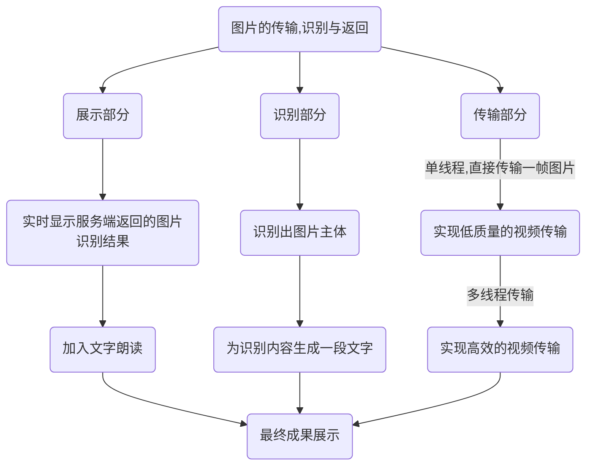

# 数据通信大作业

## 项目概述

我们将要实现的一个服务端与多客户端的实时视频内容识别的项目

该项目允许客户端播放一段视频并将其实时传输给服务端，服务端识别视频内容主体后返回识别结果供客户端显示

## 应用场景

这个项目可以为失明人士“观看”视频，丰富精神生活提供一种可能：

失明人士在本地客户端通过该项目打开一段视频，客户端将视频实时传输到服务端进行内容识别，并根据识别到的内容为视频的一段画面生成一段文字描述，将该文字描述返回到客户端然后通过机器朗读出来，让失明人士也能“观看”到视频的内容

## 预期功能

1. 视频传输（客户端、服务端）
2. 内容识别（服务端）
3. 结果展示（客户端）

## 阶段规划

## 分工情况

